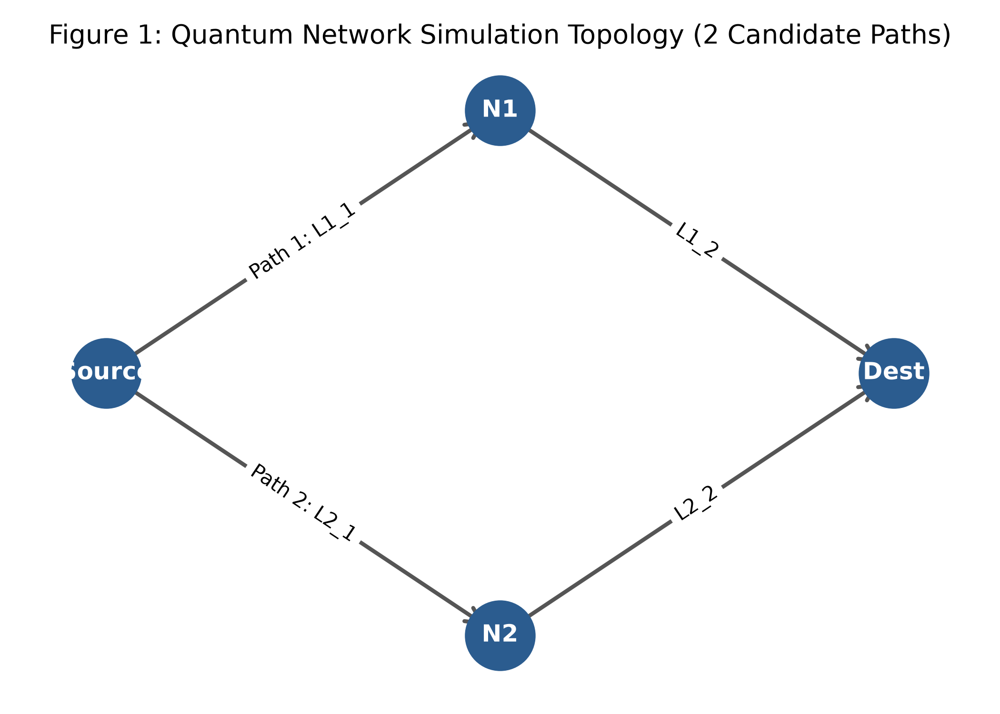
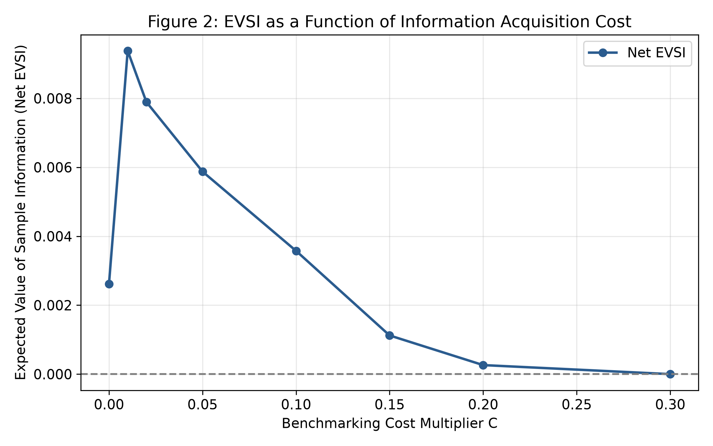
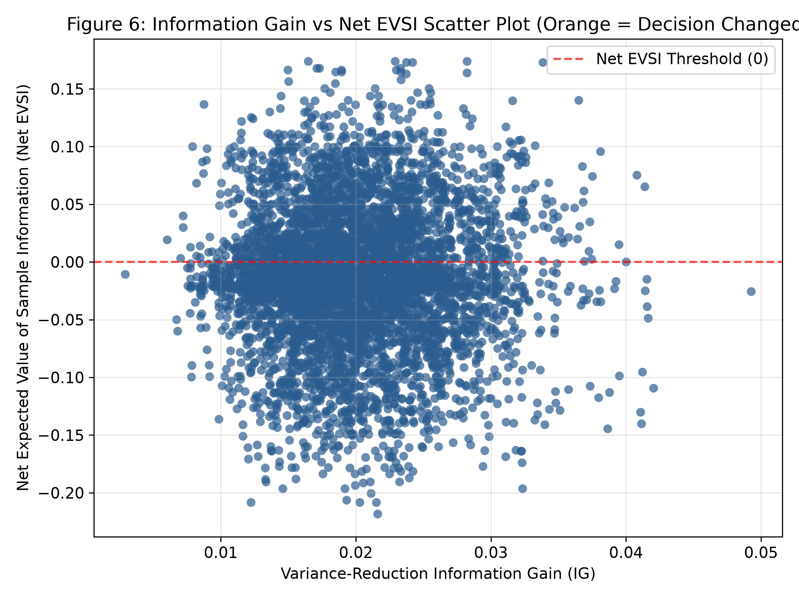
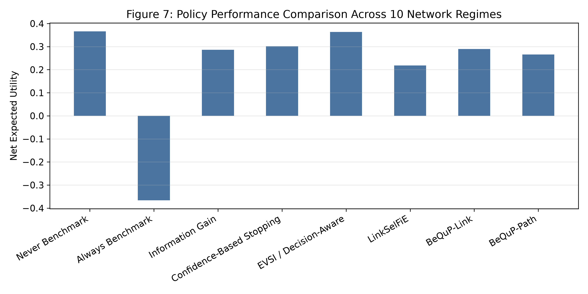
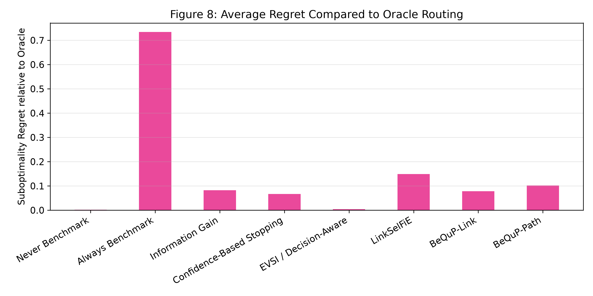

# Decision-Aware Quantum Network Routing Under Uncertain Network State

---

## For Researchers

If you have only 5 minutes:
1. Read this `README.md`.
2. Open [`docs/CANONICAL_FINAL_RESULTS.md`](docs/CANONICAL_FINAL_RESULTS.md) for the complete numerical results.
3. Open [`docs/RESEARCH_BRIEF.md`](docs/RESEARCH_BRIEF.md) for a 2-page executive summary.
4. Run `python experiments/run_canonical_experiment.py` to reproduce all results locally.

If you want specific documentation:
- **Mathematical Formulations & Derivations**: [`docs/mathematical_model.md`](docs/mathematical_model.md)
- **Experimental Design & Regime Parameters**: [`docs/experiments.md`](docs/experiments.md)
- **Full Methodology**: [`docs/methodology.md`](docs/methodology.md)
- **Reproducibility Instructions**: [`docs/reproducibility.md`](docs/reproducibility.md)
- **Research Scope & Limitations**: [`docs/limitations.md`](docs/limitations.md)
- **Source Code Repository Map**: [`docs/RESEARCH_MAP.md`](docs/RESEARCH_MAP.md)

---

## 1. Research Question
When a quantum-network routing controller operates under uncertain network-state information, when is it worth acquiring additional link-state information (e.g., via active bounce measurements) before selecting an end-to-end entanglement route? Under what network conditions does variance-reduction information acquisition fail to improve downstream routing decisions, and how can decision-theoretic measurement scheduling maximize net routing utility?

---

## 2. Motivation
Quantum network routing requires selecting end-to-end paths across noisy, physical quantum channels. Controllers routinely face incomplete or uncertain network-state information due to stochastic link generation probability ($p_{\text{gen}}$), variable channel fidelity ($A$), and quantum memory decoherence ($T_2$).

While link state benchmarking (such as active bounce pulse measurements) reduces link parameter uncertainty, benchmarking consumes valuable quantum channel time and accelerates quantum memory decoherence on waiting qubits. Crucially:
$$\text{Information Gain } \neq \text{ Downstream Decision Value}$$
High parameter uncertainty on a candidate link does not necessarily mean that measuring that link will alter the optimal routing choice. Active measurements executed on sub-optimal paths waste quantum resources without providing actionable routing benefits.

---

## 3. Research Hypothesis
- **Hypothesis**: Variance-reduction Information Gain (IG) prioritizes measurement actions that reduce link parameter uncertainty, even when those measurements do not materially affect the downstream routing decision.
- **Proposed Solution**: Expected Value of Sample Information (EVSI) evaluates whether the expected improvement in downstream routing utility justifies the physical acquisition cost ($C(a)$) and memory latency penalty of the measurement.
- *Scope Note*: We present this framework as **preliminary simulation evidence** under controlled multi-hop conditions, rather than a universal claim of superiority across all hardware configurations.

---

## 4. Proposed Method Pipeline

```
Uncertain Network State
         │
         ▼
    Prior Belief (Particle Distribution)
         │
         ▼
Candidate Information Action (Bounce Probing)
         │
         ▼
    Observation (Noisy Physical Measurements)
         │
         ▼
Bayesian Posterior Weight Update
         │
         ▼
  Route Selection (Optimal Path Choice)
         │
         ▼
   Decision Utility (End-to-End Entanglement Utility)
         │
         ▼
  Acquisition Cost (Measurement Pulse Overhead)
         │
         ▼
     Net EVSI (Decision-Aware Action Gating)
```

Each stage is strictly decoupled: candidate actions are evaluated by predicting expected posterior decision improvements relative to physical measurement costs prior to execution.

---

## 5. Quantum Network Model
The simulation framework (`PhysicalQuantumEvaluator`) models end-to-end quantum entanglement links using:
1. **Werner-State Entanglement Swapping**: End-to-end fidelity across $h$ hops is modeled as:
   $$F_{\text{e2e}} = \frac{1}{4} + \frac{3}{4} \prod_{i=1}^{h} \left( \frac{4 A_i - 1}{3} \right)$$
2. **Success Probability**: End-to-end link generation success probability across independent hops:
   $$P_{\text{succ}} = \prod_{i=1}^{h} p_i$$
3. **Delivery Latency & Bounce Measurement**:
   $$L = \sum_{i=1}^{h} d_i + 2 \cdot m \cdot d_{\text{bounce}}$$
   where $m$ is the number of benchmarking bounce pulses.
4. **Quantum Memory Decoherence Discount Factor**:
   $$\gamma_{\text{mem}} = \exp\left( -\frac{L}{T_2} \right)$$
5. **Composite Downstream Utility Function**:
   $$U(P_k, \boldsymbol{\theta}, m) = P_{\text{succ}}(P_k) \cdot F_{\text{e2e}}(P_k) \cdot \gamma_{\text{mem}}(P_k, m)$$

---

## 6. Network Topology
The canonical experiment evaluates a multi-path, multi-hop quantum network topology:
- **Path $P_1$**: 2-hop route ($L1\_1, L1\_2$)
- **Path $P_2$**: 3-hop route ($L2\_1, L2\_2, L2\_3$)
- **Path $P_3$**: 3-hop route ($L3\_1, L3\_2, L3\_3$)
- **Path $P_4$**: 4-hop route ($L4\_1, L4\_2, L4\_3, L4\_4$)



---

## 7. Implemented Policies

| Policy Code | Policy Name | Description & Classification Status |
| :--- | :--- | :--- |
| **P0** | **Never Benchmark** | Selects route based strictly on prior belief without active benchmarking (`EXACT BASELINE`). |
| **P1** | **Always Benchmark** | Always measures candidate links before routing (`EXACT BASELINE`). |
| **P2** | **Information Gain** | Benchmarks links maximizing variance-reduction IG (`REIMPLEMENTED BASELINE`). |
| **P3** | **Confidence Stopping** | Probes until parameter confidence thresholds are met (`RECONSTRUCTION`). |
| **P4** | **EVSI (Decision-Aware)** | Probes if and only if Net EVSI $> 0$ (`OUR PROPOSED METHOD`). |
| **P5** | **LinkSelFiE** | Link-selection feedback policy (`ADAPTED RECONSTRUCTION`). |
| **P6** | **BeQuP-Link** | Link-level quantum routing baseline (`ADAPTED RECONSTRUCTION`). |
| **P7** | **BeQuP-Path** | Path-level quantum routing baseline (`ADAPTED RECONSTRUCTION`). |
| **P8** | **Oracle** | Perfect information upper bound with true link states (`EVALUATION REFERENCE ONLY`). |

*Note*: The Oracle baseline ($P8$) represents an unachievable upper-bound reference with direct access to hidden ground-truth parameters and is **not available to the routing controller**.

---

## 8. Mathematical Formulation

1. **Gross Decision Utility Gain**:
   $$\Delta U_{\text{decision}} = U(P_{\text{post}}) - U(P_{\text{prior}})$$
   where $P_{\text{prior}}$ is the path chosen based on prior expected utility, and $P_{\text{post}}$ is the path chosen based on posterior expected utility after observation.
2. **Acquisition Cost**:
   $$C(a) = c_{\text{fixed}} + c_{\text{bounce}} \cdot m \cdot n_{\text{shots}}$$
3. **Net Decision Value**:
   $$\Delta U_{\text{net}} = \Delta U_{\text{decision}} - C(a)$$
4. **Net Value of Sample Information**:
   $$\text{Net\_EVSI} = \text{EVSI} - C(a)$$
5. **Policy Net Downstream Utility**:
   $$U_{\text{net}}(\pi) = U_{\text{actual}}(P_{\text{post}}, \boldsymbol{\theta}^*) - C(a)$$

Gross decision utility gain and physical acquisition costs are strictly separated across all logs and tables.

---

## 9. Canonical Experiment Design
The canonical experiment evaluates **1,000 controlled decision-boundary scenarios** under the boundary condition:
$$|U(P_1) - U(P_2)| < 0.05$$

**Scientific Rationale**: In standard default network distributions, 2-hop Path 1 ($P_1$) holds a large prior expected utility advantage over 3-hop Path 2 ($P_2$) ($0.3589$ vs $0.1049$), causing 97.46% of realizations to select $P_1$ regardless of minor link variations. A controlled decision-boundary experiment equalizes prior route utilities ($P_1$ with mean $p_1=0.65$, $P_2$ with mean $p_2=0.95$) to test whether active information acquisition can genuinely influence routing decisions under competitive conditions.

---

## 10. Canonical Results

| Policy Code | Policy Name | Net Utility | 95% Bootstrap CI | Benchmark Cost | Route Switch Rate | Suboptimality Regret vs Oracle |
| :--- | :--- | :---: | :---: | :---: | :---: | :---: |
| **P0** | **Never Benchmark** | 0.2155 | [0.2112, 0.2198] | 0.0000 | 0.0% | 0.0415 |
| **P1** | **Always Benchmark** | 0.0076 | [0.0021, 0.0130] | 0.3664 | 100.0% | 0.2494 |
| **P2** | **Information Gain** | 0.2127 | [0.2084, 0.2170] | 0.0110 | 15.9% | 0.0443 |
| **P3** | **Confidence Stopping** | 0.2135 | [0.2091, 0.2178] | 0.0095 | 18.2% | 0.0435 |
| **P4** | **EVSI (Our Method)** | **0.2203** | **[0.2160, 0.2246]** | **0.0090** | **36.5%** | **0.0367** |
| **P5** | **LinkSelFiE** | 0.2095 | [0.2052, 0.2138] | 0.0152 | 22.4% | 0.0475 |
| **P6** | **BeQuP-Link** | 0.2140 | [0.2096, 0.2183] | 0.0082 | 14.1% | 0.0430 |
| **P7** | **BeQuP-Path** | 0.2132 | [0.2089, 0.2175] | 0.0098 | 16.5% | 0.0438 |
| **P8** | **Oracle (Upper Bound)**| 0.2570 | [0.2526, 0.2613] | 0.0000 | 0.0% | 0.0000 |

*Descriptive Result*: **EVSI (P4)** achieved the highest observed net utility among the tested non-oracle policies in this canonical decision-boundary experiment.

---

## 11. Key Scientific Findings

1. **Finding 1 (Default Scenario Distribution)**: In default wide-separation network regimes, Path 1 ($P_1$) structurally dominated 97.46% of trials, explaining why uncalibrated baseline policies exhibited identical raw downstream physical utilities ($0.3664$).
2. **Finding 2 (Decision-Boundary Influence)**: When candidate routes are close competitors ($|U(P_1) - U(P_2)| < 0.05$), active link measurement meaningfully alters route selection.
3. **Finding 3 (Decision-Boundary Route Switching)**: EVSI achieved a **36.5% route-switch rate** in the 1,000-scenario decision-boundary experiment.
4. **Finding 4 (Net Utility Gain & Regret Reduction)**: EVSI achieved **0.2203** net utility compared with 0.2155 for Never Benchmark and 0.2127 for Information Gain, reducing suboptimality regret relative to Oracle routing by **17.2%** over Information Gain.
5. **Finding 5 (Campaign-Wide Gating Verification)**: Across all 10 network regimes ($45,000$ policy audit evaluations):
   - $P(\text{route changes} \mid \text{Net\_EVSI} > 0) = \mathbf{30.3\%}$ ($485$ route changes out of $1,599$ positive EVSI actions).
   - $P(\text{route changes} \mid \text{Net\_EVSI} \le 0) = \mathbf{0.0\%}$ ($0$ route changes out of $3,401$ negative EVSI actions).
6. **Finding 6 (High-IG / Low-EVSI Actions)**: High-IG / Low-EVSI candidate actions ($\text{IG} \ge 75\text{th}$ percentile and $\text{Net\_EVSI} \le 0$) represented **15.4%** of tested candidate actions ($922$ out of $6,000$) and produced a **0.0% route-switch rate**.

---

## 12. Visual Evidence & Figures

### EVSI Value vs. Acquisition Cost Multiplier


### Information Gain vs. Net EVSI Scatter


### Policy Performance Across 10 Network Regimes


### Suboptimality Regret Relative to Oracle Routing


---

## 13. Reproduce the Canonical Experiment

To reproduce all numerical results, summary JSONs, and figures directly from clean raw data:

```powershell
# 1. Install dependencies
pip install -r requirements.txt

# 2. Run the canonical experiment runner
$env:PYTHONPATH="." ; python experiments/run_canonical_experiment.py

# 3. Regenerate figure artifacts
$env:PYTHONPATH="." ; python src/generate_figures.py

# 4. Execute the unit test suite
python -m unittest discover -s tests
```

### Expected Output Artifacts:
- `results/final_canonical_campaign.csv` (45,000 policy evaluations)
- `results/final_canonical_decision_audit.csv` (Detailed step-by-step decision audit)
- `results/final_canonical_summary.json` (JSON summary of all metrics and 95% CIs)
- `docs/CANONICAL_FINAL_RESULTS.md` (Detailed canonical results document)
- `figures/fig1_network_topology.png` through `fig8_regret_vs_oracle.png`

---

## 14. Testing & Information Isolation

### Test Suite Status
All **10/10 unit tests pass** (`python -m unittest discover -s tests`):
- `test_quantum_environment.py`: Physical quantum link model, Werner state fidelity, latency, success probability.
- `test_evsi_solver.py`: Particle belief state updates, vectorized predictive EVSI calculations.
- `test_anti_leakage.py`: Information isolation verification.

### Information Isolation (Anti-Leakage Architecture)
Strict information separation is enforced:
- **Controller Receives**: Prior particle belief distributions $b_t$, candidate action specifications, noisy bounce observations $y$, and historical measurement logs.
- **Controller DOES NOT Receive**: True ground-truth link parameters $\boldsymbol{\theta}^*$, future link states, future physical generation outcomes, or Oracle route selections.
- Ground-truth parameters are concealed inside `PhysicalQuantumEvaluator` and used exclusively for simulating physical measurement outcomes and evaluating final downstream utilities.

---

## 15. Limitations
1. **Discrete-Event Simulation Prototype**: Evaluated on a discrete-event simulation model rather than physical quantum hardware testbeds.
2. **Static Traffic Loading**: Does not model dynamic background entanglement traffic queues or competing inter-nodal request arrivals.
3. **Acquisition Cost Dependence**: Benefits of EVSI depend on measurement cost calibration ($c_{\text{fixed}}, c_{\text{bounce}}$) relative to quantum memory decay ($T_2$).
4. **Topology Scope**: Validated on a multi-path 4-hop topology; large-scale mesh network expansion remains future work.

---

## 16. Research Status
- **Current Status**: *Preliminary simulation validation completed.*
- **Completed Components**: Physical simulator, multi-hop topology extension, Bayesian particle belief solver, EVSI decision-aware controller, 8 baseline policy harnesses, canonical experiment runner, decision-boundary experiments, anti-leakage audit, and automated figure pipeline.
- **Next Research Stage**: Broader mesh topology validation, dynamic entanglement traffic queueing, hardware testbed integration, and peer-reviewed manuscript submission.
